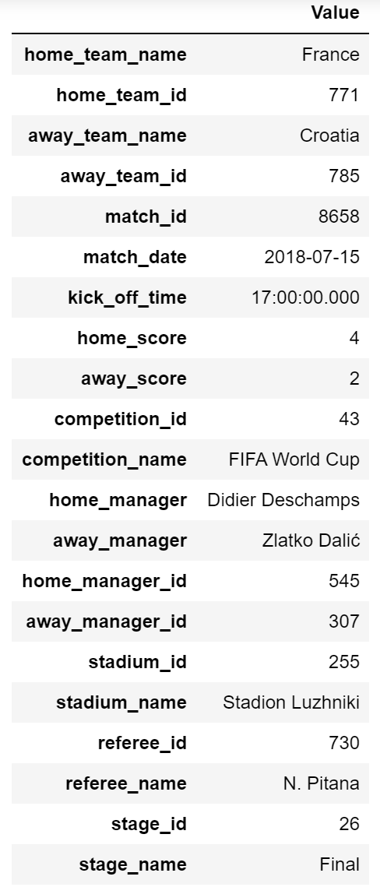
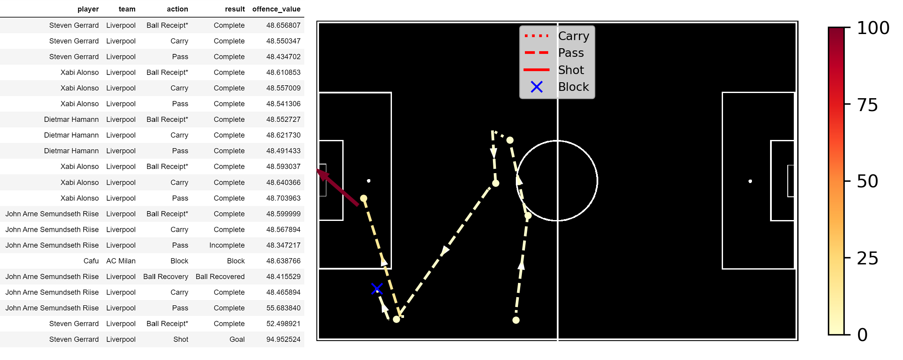

# footyanalytics
An analysis tool for football (soccer) match event data- creates ratings and visualisation for match events.

Implementation of a classifier to predict the odds that a given action in a football match will lead to a goal being scored. The algorithm is trained on the initial and final location of the actions, the type of action, its location with respect to the goal and the pattern of play (free kicks, throw-ins etc.). The classifier then learns whether the action leads to a goal (scored or conceded) in the next *x* match events and then values that action. This is then converted into an action rating as outlined in "Actions Speak Louder Than Goals: Valuing Player Actions in Soccer - https://dl.acm.org/doi/10.1145/3292500.3330758 ."

The components of this project are:

A Match object that contains all the information associated with the football match including events, lineups and match details. The details are available to view:

A series of actions can be viewed by the plotting function or the events_viz method in the Match object:

The colour scale is based off the offensive rating of the action

The visualisation tool then plots such a series of actions, using a colourmap to scale the offensive values of the action and different markers to designate the different key actions.

